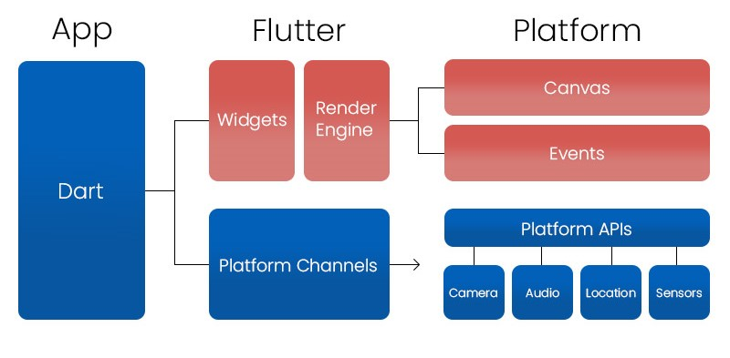

# Basic

Topics:

- Introduction & History
- Flutter Architecture
- Installation/Setup
- Create our first flutter app

## Introduction & History

Flutter is an open-source UI software development kit created by Google. It is used to develop cross-platform applications for Android, iOS, Linux, macOS, Windows, Google Fuchsia, and the web from a single codebase. First described in 2015, Flutter was released in May 2017.

- Initial release date: May 2017
- Developer: Google
- License: New BSD License
- Platforms: Android, iOS, Fuchsia, Web platform, macOS, Microsoft Windows, Linux
- Programming languages: Dart, C, C++

## Flutter Architecture

Flutter Architecture application mainly consists of:

Widgets
Gestures
Concept of State
Layers

## Installation/Setup

Go to the [Flutter doc](https://docs.flutter.dev/get-started/install) to install flutter in your sustem.

Steps:

- Download and Install [Git](https://git-scm.com/)
- Download and Install [Android Studio](https://developer.android.com/studio) and [Java](https://www.java.com/en/download/) (If need).
- Download and Install [VS Code](https://code.visualstudio.com/)
- Download and Extract [Flutter SDK](https://docs.flutter.dev/get-started/install)
- Add Flutter SDK path to System environment
- Configure Android Studio
- Configure VS Code

## Create our first flutter app

- Using Android Stdio
- Using VS Code
- Flutter Project Structure
- UI Basic
- Organize the code
- Add logic to application

Thank you.
